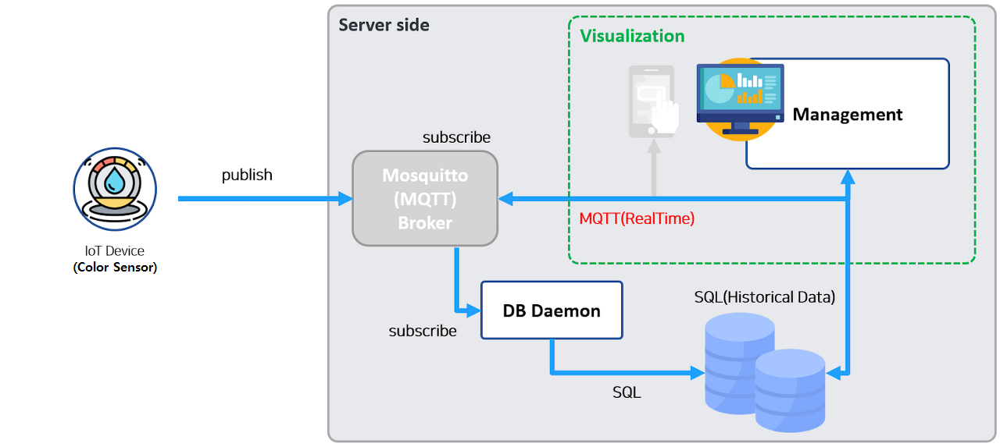
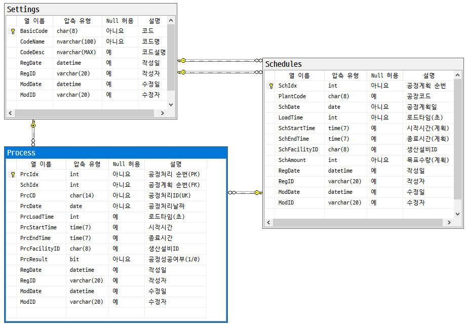

## 미니프로젝트 2

### 포트폴리오 개발

#### MES 공정관리
- 용어
    - MES : Manufacturing Execution System 생산실행 관리 시스템
        - 생산현장에서 실시간으로 제조/작업 계획, 실행, 추적, 모니터링하는 시스템
        - 작업지시, 생산실적, 품질관리, 설비가동모니터링 등
        - ERP(회사의 모든 데이터)에서 제조/생산에 관련된 데이터를 전달받아서 실시간 처리한 뒤 결과를 다시 ERP로 전달
    - MRP
    - SmartFactory

##### 작업 개요

전체 구조도

- IoT 디바이스 : C# 시뮬레이터로 대체, MQTT Publish 병행
- MQTT 시스템 : Mosquitto broker 사용
- MQTT Subscriber : MQTT 데이터 수신 및 DB 저장
- 공정관리 시스템 : WPF 공정관리 모니터링 및 계획, 리포트

ERD

##### 양품/불량품 선별용 IoT 센서 장비
- [컬러센서](https://www.devicemart.co.kr/goods/view?no=1066926) : 색상으로 선별
    - 
- [로드셀무게센서](https://www.devicemart.co.kr/goods/view?no=12146929) : 무게로 선별
    - 
- [적외선거리센서](https://www.devicemart.co.kr/goods/view?no=1341808)

- [적외선감지센서](https://www.devicemart.co.kr/goods/view?no=1310703)

- [적외선열화상센서](https://www.devicemart.co.kr/goods/view?no=12382843)

- [사운드센서](https://www.devicemart.co.kr/goods/view?no=38340)

- [3D센서](https://www.devicemart.co.kr/goods/view?no=14930970)

- [비전센서](https://www.devicemart.co.kr/goods/view?no=15548729)

- 2019년도 학생 작품 영상 : https://www.youtube.com/watch?v=qo5e_HCUAl8
- 유튜브에서 sorting machine으로 검색

##### 양품/불량품 선별용 모터장비
- [컨베이어벨트]()
- [서브모터]()
- [푸쉬모터]()
- [에어실린더]()
- [회전테이블]()
- [로봇암]()
- [AGV]()

##### 양품/불량품 선별 예
- 

##### 공정관리 ERD
1. 

#### 파이썬 AI + ASP.NET 연동
- 참조소스
- https://github.com/hugoMGSung/works-need-it-csharp/tree/main/miniprojects/MRPApp

### 파이널 프로젝트
#### 주제 선정
#### 프로젝트 주제 발표
#### 프로젝트 사용 재료 선정